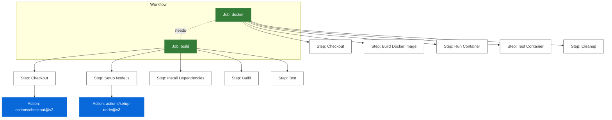

# Basic CI CD

## Wymagania

Konto na GitHub (no właśnie! ;)).

## Cel

Celem ćwiczenia jest zbudowanie podstawowego CI w GitHub Actions.

CI powinno spełniać wymagania:
- Uruchamiać się przy Pull Request do brancha `main`
- Uruchamiać się przy push do brancha `main`
- Weryfikować poprawność kodu przez wywołanie testów
- Zbudować kontener z aplikacją
- Uruchomić aplikację z obrazu kontenera
- Sprawdzić czy kontener działa poprawnie z wykorzystaniem klucza API

## Krok 0 - Fork repozytorium

Wykonaj fork tego repozytorium (przycisk "Fork" w prawym górnym rogu).

> Więcej o forkowaniu w [dokumentacji GitHub](https://docs.github.com/en/get-started/quickstart/fork-a-repo).

Sklonuj repozytorium na swój komputer lub cloud shell.

```bash
git clone https://github.com/your-username/weather-app
cd weather-app
```

Jeżeli chcesz, możesz uruchomić aplikację lokalnie:

```bash
npm install
npm start
```

Otwórz przeglądarkę i przejdź do strony http://localhost:3000.

## Krok 1 - Przygotowanie klucza API

1. Utwórz konto na [OpenWeatherMap](https://home.openweathermap.org/)
2. Pobierz klucz API z [API Keys](https://home.openweathermap.org/api_keys)
3. Utwórz plik .env i wklej swój klucz
```bash
sed -i 's/your_openweathermap_api_key/<twój klucz>/' .env
```

## Krok 2 - Tworzenie workflow CI

Utwórz plik `.github/workflows/ci.yml` i postępuj zgodnie z poniższymi krokami:

### 2.1 Dodaj metodę uruchomienia workflow

[Dokumentacja triggerów workflow](https://docs.github.com/en/actions/writing-workflows/choosing-when-your-workflow-runs/triggering-a-workflow)

```yaml
name: CI weather app

on:
  workflow_dispatch:
  push:
    branches: [ main ]
  pull_request:
    branches: [ main ]
```


### 2.2 Dodaj job budowania

W ramach joba `build` wykonujemy następujące kroki:

- checkout kodu
- setup Node.js
- instalowanie zależności 
- budowanie aplikacji
- uruchomienie testów

[Dokumentacja jobs](https://docs.github.com/en/actions/using-jobs)

`Job` to grupa kroków w workflow, która może być uruchomiona w ramach jednego runnera.
`Step` to pojedyncza operacja w ramach joba, może być ich kilka. Może to być polecenie konsoli albo `action`.
`Action` to gotowa funkcja, która może być użyta w workflow.

```yaml
jobs:
  build:
    name: Build and Test
    runs-on: ubuntu-latest
    steps:
      - uses: actions/checkout@v3
      
      - name: Setup Node.js
        uses: actions/setup-node@v3 # coś jak apt install nodejs npm
        with:
          node-version: '20'
          cache: 'npm'
          
      - name: Install Dependencies
        run: npm ci
        
      - name: Build Application
        run: npm run build
        
      - name: Run Tests
        run: npm test
```


### 2.3 Dodaj job Dockera

W ramach joba `docker` wykonujemy następujące kroki:

- checkout kodu
- budowanie obrazu Docker

Ponieważ jest to nowy `job`, musimy ponownie zrobić checkout.
Wykorzystujemy `needs` aby wymusić uruchomienie joba `build` przed jobem `docker`.

```yaml
  docker:
    name: Docker Build and Test
    needs: build
    runs-on: ubuntu-latest
    steps:
      - uses: actions/checkout@v3
      
      - name: Build Docker image
        run: docker build -t weather-app .
```

### 2.4 Dodaj klucz do GitHub Secrets 

Dodaj klucz do GitHub Secrets jako `WEATHER_API_KEY`.

1. Actions > Secrets and variables > Actions > New repository secret
2. Name: WEATHER_API_KEY
3. Value: <twój klucz>
4. Save

W kolejnym etapie w ramach joba `docker` wykorzystamy ten klucz, po to aby aplikacja działała poprawnie i faktycznie mogła zwrócić pogodę dla `Zakopanego`.

[Dokumentacja GitHub Secrets](https://docs.github.com/en/actions/security-guides/encrypted-secrets)

### 2.5 Dodaj testy kontenera

W ramach joba `docker` wykonujemy następujące kroki:

- uruchomienie kontenera
- poczekanie na uruchomienie kontenera
- testowanie strony głównej (tylko czy działa)
- testowanie endpointu pogody dla `Zakopane`

```yaml
      - name: Run Docker container
        run: |
          docker run -d \
            -p 3000:3000 \
            -e WEATHER_API_KEY=${{ secrets.WEATHER_API_KEY }} \
            --name weather-app-container \
            weather-app
          
          # Poczekaj na uruchomienie kontenera
          sleep 5
        
      - name: Test running container
        run: |
          # Test endpointu głównego
          curl -f http://localhost:3000/ || exit 1
          
          # Test endpointu pogody dla Zakopanego
          response=$(curl -f http://localhost:3000/weather/Zakopane)
          if [[ $response == *"tired"* ]]; then
            echo "Aplikacja jest zmęczona, szefie."
            exit 1
          fi
```

### 2.5 Dodaj sprzątanie

Porządek musi być.
Niektóre zdarzenia mogą być wywołane w zależności od wyniku innych jobów.

```yaml
      - name: Cleanup
        if: always()
        run: docker rm -f weather-app-container
```
[Dokumentacja conditional steps](https://docs.github.com/en/actions/using-jobs/using-conditions-to-control-job-execution)

## Krok 3 - Testowanie workflow

1. Zatwierdź i wypchnij zmiany

```bash
git add .
git commit -m "Dodaj workflow CI"
git push
```

1. Utwórz Pull Request do brancha main
2. Sprawdź zakładkę Actions w GitHub, aby zobaczyć działający workflow
3. Zweryfikuj czy wszystkie joby zakończyły się sukcesem

## Krok 4 - Weryfikacja wymagań

Upewnij się, że Twój workflow:
- [x] Uruchamia się przy PR do main
- [x] Uruchamia się przy push do main
- [x] Buduje i testuje kod
- [x] Buduje obraz Docker
- [x] Testuje działający kontener
- [x] Sprząta zasoby

Twój pipeline CI jest gotowy do wyłapywania błędów zanim trafią na produkcję!

[Dokumentacja GitHub Actions](https://docs.github.com/en/actions)

## Struktura Workflow



Diagram pokazuje:
- Workflow zawiera dwa joby: `build` i `docker`
- Job `docker` zależy od joba `build` -> `needs`
- Każdy job składa się z kroków `steps`
- Niektóre kroki używają predefiniowanych `actions`

> Więcej o strukturze workflow w [dokumentacji GitHub](https://docs.github.com/en/actions/learn-github-actions/understanding-github-actions)
